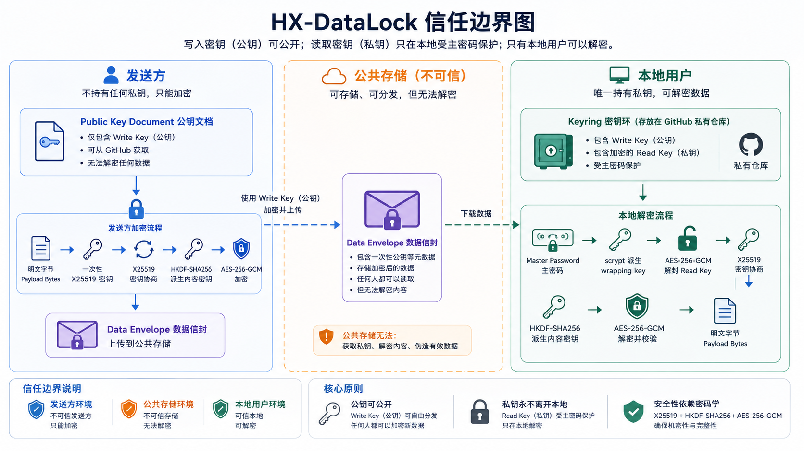
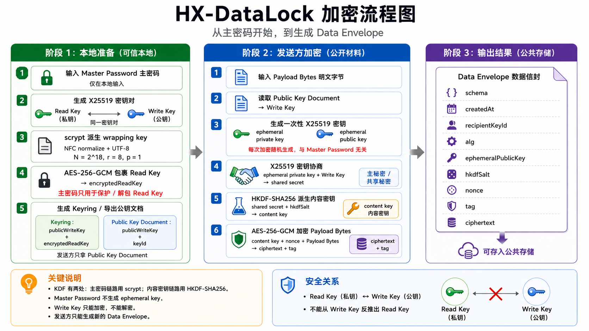
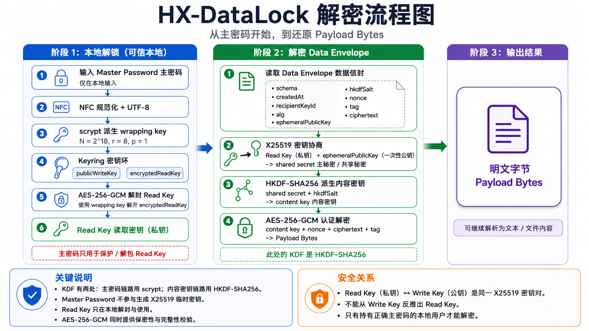

# HX-DataLock

HX-DataLock 是一个面向"公共存储可读、写入方不可读、用户本地可解密"场景的加密 SDK。它把应用传入的 `Payload Bytes` 转成可携带的 `Data Envelope` JSON 密文, 让密文可以放在网盘、对象存储、数据库或其他不可信存储中。

核心边界是: 写入方只拿 `Public Key Document`, 因此只能加密新数据; 用户本地持有完整 `Keyring` 和 `Master Password`, 才能解封 `Read Key` 并打开历史密文。

`Public Key Document` 不需要保密, 但必须保证真实性。发送方如果从不可信位置读取到被替换的公钥文档, 新数据会被加密给替换者的 Write Key。应用层应通过认证通道分发、公钥指纹确认、`keyId` pinning 或后续签名机制防止 key-substitution。



## 什么时候适合

- 前端、CLI、自动化任务或第三方系统需要提交加密数据, 但不应该具备解密能力。
- 用户愿意在本地输入高熵 `Master Password`, 解密只发生在自己的设备上。
- 密文需要跨语言流转: Python、Node/TypeScript、Kotlin 读取同一种 JSON 文档。
- 存储层不可信, 只能假设它会读取、复制、删除、重放或篡改密文。

不适合的范围:

- HX-DataLock 是加密 codec, 不是同步、数据库、对象存储或业务序列化框架。
- 当前文件助手面向 25 MB 以内的完整数据包; 大文件分片和流式处理应由应用层或后续专用格式承接。
- `Data Envelope` 会保留解密所需的公开元数据, 用于跨语言解析、收件方匹配和认证解密; 业务隐私边界应放在 `Payload Bytes` 内部。

## 工作流程

发送方只需要 `Public Key Document`。它可以加密新数据, 但没有 `Master Password` 和 `Read Key`, 不能打开已有密文。



用户本地使用完整 `Keyring` 和 `Master Password` 解封 `Read Key`, 再打开 `Data Envelope`。Master Password 不写入 Keyring、Public Key Document 或 Data Envelope。



## Write Key 和 Read Key 的关系

`Write Key` 是 X25519 密钥对的公开半边，写在 `Public Key Document` 里；`Read Key` 是匹配的私有半边，被 Master Password 派生出的 wrapping key 加密后写在 `Keyring` 里。Write-only Sender 用 Write Key 和一次性临时密钥为新的 `Data Envelope` 建立共享密钥，所以它能 Lock 新数据；但 X25519 的单向性质不允许从 Write Key 推回 Read Key，所以它不能 Open 已有密文。

如果完整 `Keyring` 泄漏，攻击者仍然拿不到明文 Read Key，但可以离线猜 Master Password 来尝试解封 `encryptedReadKey`。因此 Keyring 应作为私有本地文件保存和备份；适合放入公共或自动化环境的是 `Public Key Document`，不是完整 Keyring。

## 快速开始

Python CLI 是当前仓库的最短体验路径:

```sh
uv sync --dev
export HXDL_MASTER_PASSWORD="use-a-long-high-entropy-password"

uv run hxdl init --keyring keyring.hxdl.json --password-env HXDL_MASTER_PASSWORD
uv run hxdl export-public --keyring keyring.hxdl.json --out public.hxdl.json
uv run hxdl lock --public public.hxdl.json --in message.txt --out message.hxdl.json
uv run hxdl open --keyring keyring.hxdl.json --in message.hxdl.json --out message.opened.txt --password-env HXDL_MASTER_PASSWORD
```

更多安装方式、API 示例和 CLI 命令见对应 SDK 自述文档。

## SDK 文档

| SDK | 范围 | 自述文档 |
| --- | --- | --- |
| Python | 完整 SDK、Sender DataLock、User DataLock、CLI、本地文件助手 | [sdk/py/README.md](sdk/py/README.md) |
| Node/TypeScript | 完整 SDK、Sender DataLock、User DataLock、CLI、本地文件助手 | [sdk/node/README.md](sdk/node/README.md) |
| Kotlin/JVM | 用户侧 SDK, 可打开 Envelope, 也可用完整 Keyring 本地加密 | [sdk/kotlin/README.md](sdk/kotlin/README.md) |

## 设计与规范

- [格式与 SDK 规范](docs/spec/v1.md): 算法、JSON 文档格式、错误码、SDK 表面和兼容性规则。
- [加密与解密数据流](docs/data-flow-v1.zh-CN.md): 从 Master Password、Keyring、Public Key Document 到 Data Envelope 的实现数据流。
- [架构决策记录](docs/adr/): 关键取舍, 例如密钥模型、CLI 密码输入、错误码、压缩、分块和平台 keychain 边界。

## 仓库布局

- `sdk/py/`: Python SDK 和 CLI。
- `sdk/node/`: Node/TypeScript SDK 和 CLI。
- `sdk/kotlin/`: Kotlin/JVM 用户侧 SDK。
- `docs/spec/`: 规范文档。
- `docs/adr/`: 架构决策记录。
- `docs/assets/`: README 和文档图片资产。
- `tests/py/`: Python SDK/CLI 测试。
- `tests/compat/`: Python 与 Node/TypeScript 互通测试。
- `tests/kotlin/`: Kotlin 跨 SDK 测试。
- `.scratch/v1-spec/issues/`: 规格拆分与验收记录。

## 本地验证

```sh
uv run pytest -q
```

```sh
cd sdk/node
npm install
npm run build
```

```sh
cd sdk/kotlin
gradle test
```

性能观察:

```sh
uv run hxdl bench --keyring keyring.hxdl.json --password-env HXDL_MASTER_PASSWORD
node sdk/node/hx-datalock.mjs bench --keyring keyring.hxdl.json --password-env HXDL_MASTER_PASSWORD
```

Benchmark 输出是 JSON lines, 覆盖 Keyring unlock、`lockBytes`、`openBytes`、`lockFile`、`openFile` 的 1 MB、10 MB 和 25 MB 场景。它用于本机观察, 不是硬性性能承诺。

## 安全边界

HX-DataLock 是 Crypto Codec。应用仍然需要自己处理 Master Password 的生成和保存、Keyring 备份、Public Key Document 真实性、公共存储的删除/重放/冲突解决、Payload Bytes 的业务序列化, 以及设备入侵、运行时内存抓取、恶意依赖和 UI 钓鱼等本地风险。

HX-DataLock 不把密码尝试锁定当作离线安全控制: 一旦 Keyring 被复制, 攻击者可以脱离服务端限制进行猜测。真正有效的防线是高熵 Master Password、scrypt 成本和尽量减少 Master Password 驻留。

## Keyring Check

`.github/workflows/keyring-check.yml` 会在仓库提交了 `keyring.hxdl.json` 时用 CLI 校验它的 v1 结构，并扫描明显的原始私钥标记。如果仓库没有提交 `keyring.hxdl.json`，workflow 会明确输出 skipped；这只表示没有 Keyring 可校验，不表示已经验证过某个 Keyring。当前仓库不要求提交 Keyring。
